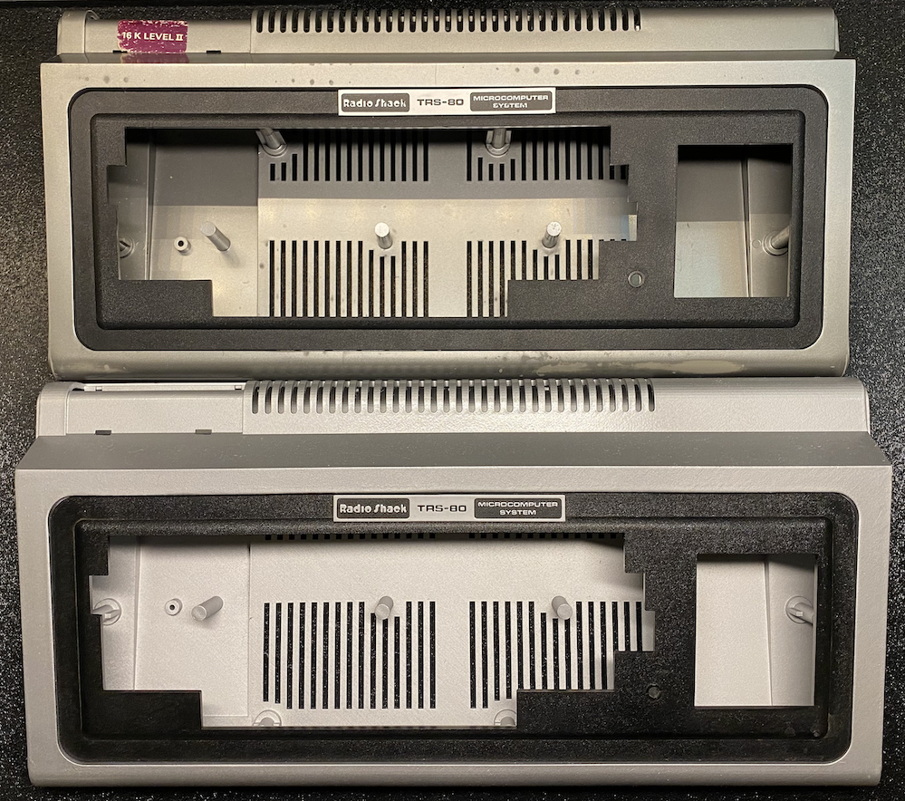
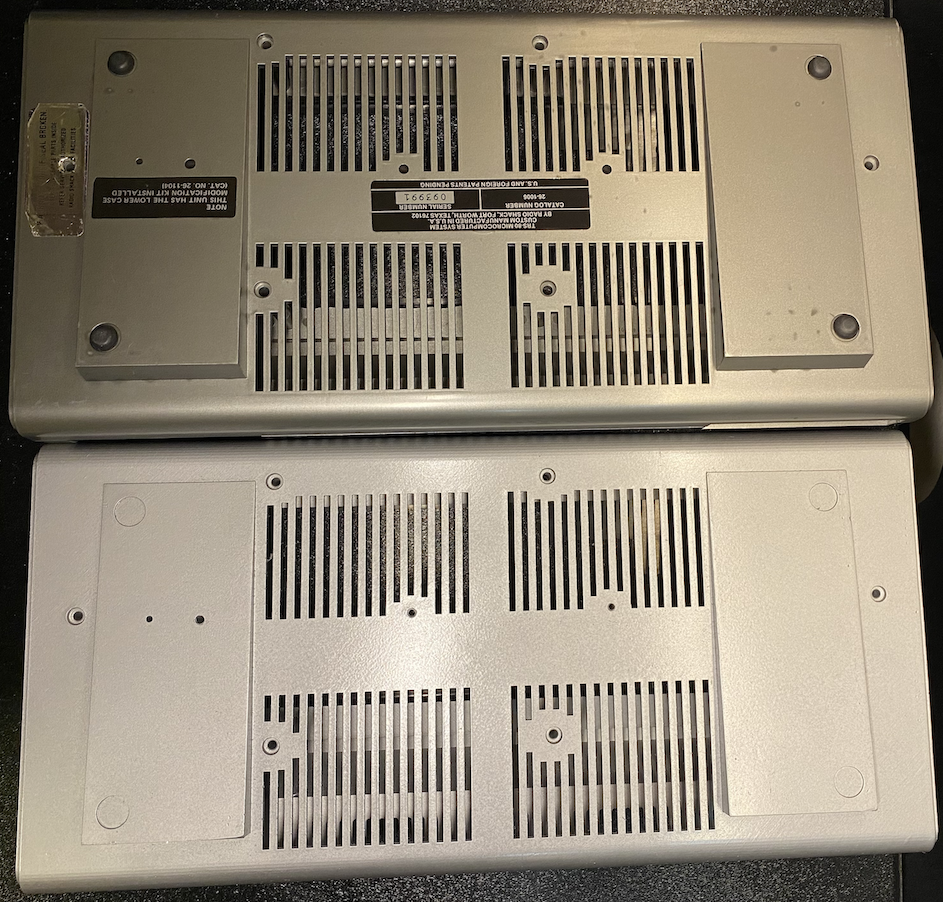
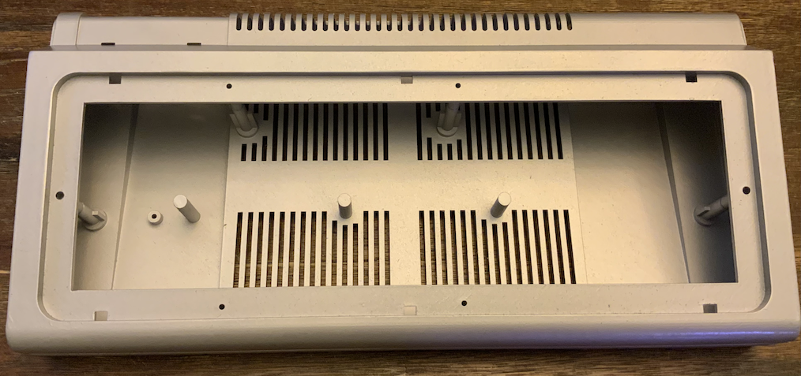
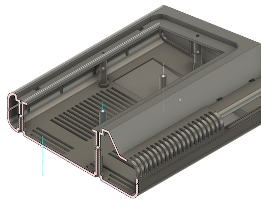
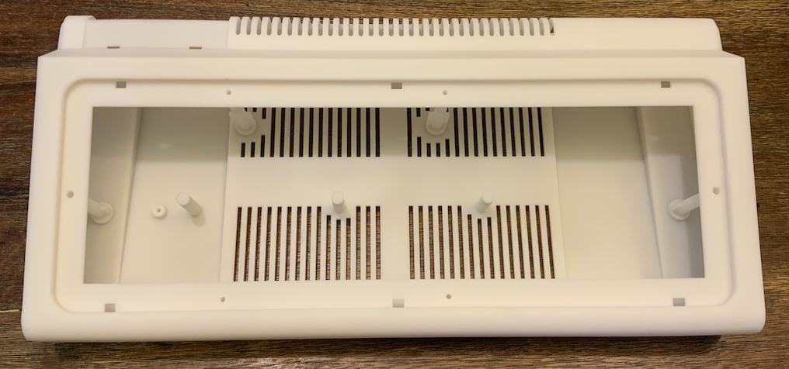
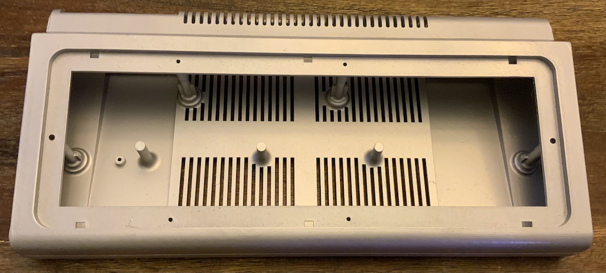
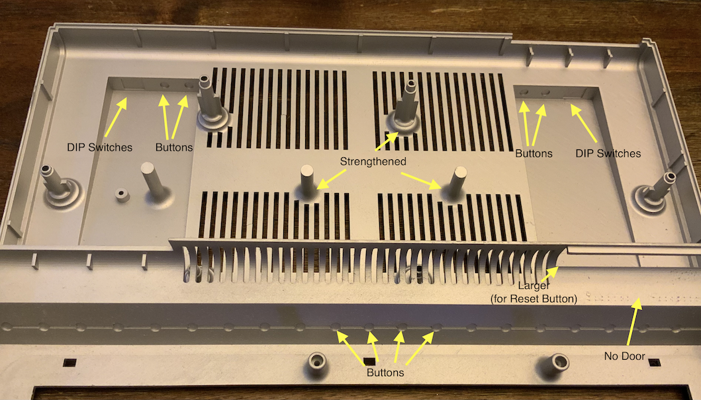
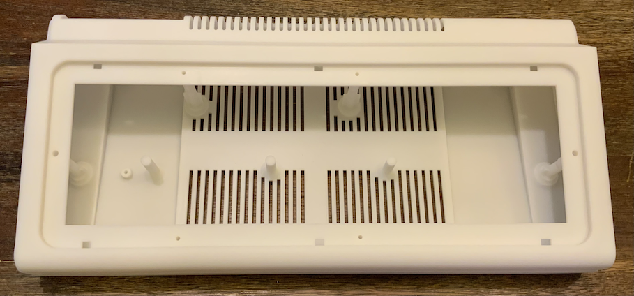

# TRS-80 Model 1 - Main Enclosure - 3D Printer

This page provides two different versions of the TRS-80 Model 1 main enclosure:

- The original, replicating the original case as closely as possible.
- The improved, a main enclosure still compatible with the original but with a few enhancements.

Both cases are compatible with the original, fitting nicely on top of each other, and the top and bottom parts can replace broken parts of the original case.

Here is a comparison of a painted replica to an original case:

## The Original

A fully painted case after printing:

A cross-section of the case:

### STL

The following files are available in STL format:
[STL (Top)](Original_Top.stl)
[STL (Bottom)](Original_Bottom.stl)

### Print Instructions

You can print them yourself, but most likely you do not have such a large printer. You can order them online. What follows are instructions for JLC3DP, which I've had good experiences with. Additionally, they take care of sanding and finishing.

- Go to [JLC3DP](https://www.jlcpcb.com).
- Click the "Quote Now" button under the "3D Printing" image.
- Click the "Add 3D file" and select the STL file provided above.

A few options appear. I always selected "SLA(Resin)" for the technology, which has a very smooth surface.

The default selection of "LEDO 6060 Resin" is what I've used for the case. It is also the more affortable option.

Leave all other options as-is.

You still have to select a "Product Description". Apparently, this is some customs requirement. I've selected "Office Appliances and Accessories" and "Keyboard Enclosure" in the past.

You can then hit "Save to Cart" and checkout.

By default, they will review your designs and send you an email to pay within a few hours. Simply go back to your order page (after you've created an account) and select "Pay".

NOTE: Most of the time, however, they will also send you an email to confirm that you want to assume the risk of ordering the design as-is as they are too long and may deform during production or have parts which are too thin. I've always accepted the risk and never had any trouble.

## The Improved

A fully painted case after printing:

A cross-section of the case:

### Differences to Original

There are a few differences.

To help show these differences, here is a cross-section of the original and the improved versions:

The internal pillars that hold the PCB and keyboard in place, and their additional function of keeping the case together through screws, easily break off in the original. The new improved version has a much wider base to avoid breaking at the base of these pillars, addressing a common issue for the top and bottom of the case.

After opening the case a few times, the threads created by the self-threading screws in the old plastic are stripped and won't hold the case together anymore. To avoid this problem altogether, the improved case now has the (optional) ability to add knurled threaded inserts.

There are additional changes:

- Provides perforated areas for DIP switches, potentiometers, and buttons in the top and base of the case.
- The opening in the back has been slightly enlarged to make it easier to access the reset button.
- The door on the back, which is missing in nearly all cases nowadays, was completely removed.

Many of these improvements were suggested by various people, including Amar, Scott, and Ven.

### STL

The following files are available in STL format:
[STL (Top)](Improved_Top.stl)
[STL (Bottom)](Improved_Bottom.stl)

### Print Instructions

Use the same print instructions as the original case above.
